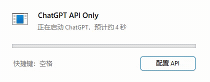
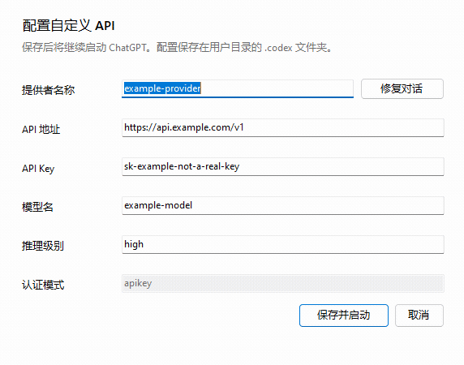

# ChatGPT API Only

ChatGPT API Only 是 Microsoft Store ChatGPT/Codex 桌面应用的单文件 Windows 启动器。它让 Electron 外壳访问 OpenAI 云端域名时立即失败，同时保留内置 Codex app-server 对自定义 API 的访问。

## 下载

正式 Windows 构建位于 [GitHub Releases](https://github.com/shellus/ChatGPTApiOnly/releases)。可直接下载 `ChatGPTApiOnly.exe`，也可下载版本化 Windows ZIP。

源码仓库不跟踪构建产物。GitHub 自动生成的 “Source code” 压缩包只包含源码，不包含可运行 EXE。

## 界面预览

### 启动进度



### API 配置与对话修复



配置动画使用 `example` 占位值，不包含真实 API 配置或本机信息。

## 启动流程

- 配置有效时显示预计启动进度并启动桌面应用。
- 配置无效时打开自定义 API 表单；启动页也可通过按钮或空格键打开表单。
- 表单保存成功后继续启动；保存或历史对话修复失败时不启动。
- 不使用启动器级单实例锁。

配置写入用户 Codex 目录下的 `config.toml` 与 `auth.json`。真实 API Key 不应写入源码、项目文档或版本控制。

## Provider 字段

`model_provider` 是 Codex 用于筛选历史对话的 provider ID。本项目固定使用 `custom`：

```toml
model_provider = "custom"

[model_providers.custom]
name = "显示名称"
```

表单中的“提供者名称”对应 `name`，不是 provider ID。“修复对话”按钮会显式地将历史对话元数据同步为 provider ID `custom`，不能把显示名称写入历史数据库。保存配置不会隐式修复对话。修复期间临时显示真实的 `n/total` 进度，完成或失败提示关闭后隐藏进度区。

同步范围与 Codex++ 的 Provider metadata sync 保持兼容：

- `sessions` 与 `archived_sessions` 中 rollout JSONL 的 `session_meta.payload.model_provider`；
- SQLite 的 `threads.model_provider`；
- 存在时同步 `local_thread_catalog.model_provider`；
- 修改前备份到 Codex 目录的 `backups_state/provider-sync`。

## 构建

项目以 Windows 自带的 .NET Framework C# 编译器构建，不依赖额外运行库：

```powershell
& "$env:WINDIR\Microsoft.NET\Framework64\v4.0.30319\csc.exe" `
  /nologo /target:winexe /platform:anycpu /optimize+ `
  /reference:System.dll /reference:System.Core.dll `
  /reference:System.Drawing.dll /reference:System.Windows.Forms.dll `
  /reference:System.Web.Extensions.dll `
  /out:ChatGPTApiOnly.exe ChatGPTApiOnly.cs
```

Provider 同步的隔离测试入口只在定义 `PROVIDER_SYNC_TEST` 时编译：

```powershell
& "$env:WINDIR\Microsoft.NET\Framework64\v4.0.30319\csc.exe" `
  /define:PROVIDER_SYNC_TEST /target:winexe `
  /reference:System.dll /reference:System.Core.dll `
  /reference:System.Drawing.dll /reference:System.Windows.Forms.dll `
  /reference:System.Web.Extensions.dll `
  /out:ChatGPTApiOnly.test.exe ChatGPTApiOnly.cs
```

测试必须通过 `CHATGPT_API_ONLY_CONFIG_DIR` 指向隔离 fixture，禁止对真实 Codex 目录运行测试入口。

## 上游与许可证

对话 Provider metadata 同步的数据范围、备份与事务策略参考了 [Codex++](https://github.com/BigPizzaV3/CodexPlusPlus) 的实现，并针对本项目的单文件 .NET Framework 启动器重新实现。

本项目采用 [GNU Affero General Public License v3.0](LICENSE)，SPDX 标识为 `AGPL-3.0-only`。
