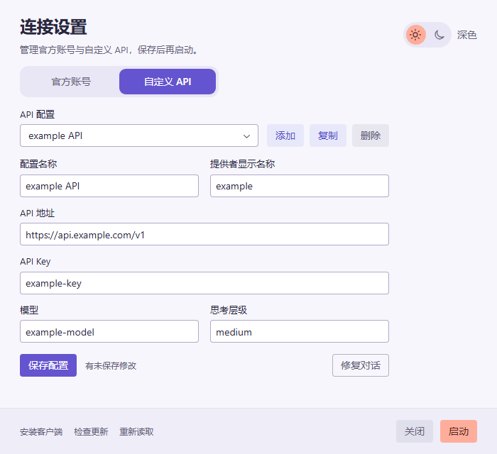

# ChatGPT API Only


**管理并切换 ChatGPT 桌面应用的多个官方账号和多套自定义 API 配置，同时处理两种模式下的代理与启动问题。**

- **多账号、多套 API 切换**：保存多个官方账号的登录凭据，以及多套 API 地址、Key、模型和思考层级，选中后应用并启动客户端。
- **官方账号独立代理**：为桌面客户端和终端中的 `codex` 设置 HTTP 代理，无需开启 Windows 系统代理或 TUN，也不修改系统代理设置。
- **自定义 API 启动加速**：让 Electron 外壳对相关 OpenAI/ChatGPT 域名的请求快速失败，避免网络超时阻塞启动；内置 Codex 后端仍正常访问自定义 API。

启动器适用于 Windows，下载单个 EXE 即可运行，无需安装启动器或额外运行库。

[下载最新版本](https://github.com/shellus/ChatGPTApiOnly/releases/latest) · [使用方法](#使用方法) · [构建与测试](#构建与测试)

## 下载与启动

从 [GitHub Releases](https://github.com/shellus/ChatGPTApiOnly/releases) 下载 `ChatGPTApiOnly.exe`，或下载 Windows ZIP 后解压运行。GitHub 自动生成的 **Source code** 压缩包只有源码，不包含 EXE。

本工具启动的是已安装的官方 ChatGPT 桌面应用。未安装时，启动器会提示前往 Microsoft Store；安装完成后重新运行启动器即可。

已有配置可用时直接启动客户端；配置不完整时打开连接设置。需要更换账号、API 或代理时，在启动进度页点击设置按钮或按空格键打开设置。

## 使用方法

### 添加和切换多个官方账号

1. 打开连接设置，进入“官方账号”Tab，点击“添加账号”并填写便于识别的名称。
2. 按需填写“HTTP 代理”，点击“应用并启动”。
3. 在官方客户端完成该账号的登录。下次打开连接设置时，启动器自动识别并收录登录账号。
4. 重复以上步骤添加其他账号；之后从账号列表选择已保存的账号，点击“应用并启动”即可切换。

账号支持重命名和删除。登录与令牌刷新由官方客户端负责，启动器保存切换前的最新凭据；在客户端退出登录后，不会恢复该账号的旧令牌。本地存在凭据不代表账号仍然有效，失效时需在客户端重新登录。


### 添加和切换多套自定义 API

1. 进入“自定义 API”Tab，点击“添加”，为这套配置命名。
2. 填写提供者名称、API 地址、API Key、模型和思考层级。
3. 点击“应用并启动”。需要另一套 API 时，继续添加，或复制已有配置后修改。
4. 从配置列表选择目标 API，点击“应用并启动”即可切换。

每套 API 单独保存连接信息和模型设置，支持复制、重命名和删除。“API 配置名称”用于区分列表条目，“提供者名称”是写入客户端配置的显示名称。



### 保存与切换何时生效

切换 Tab、选择列表条目以及添加、编辑、重命名、删除操作只改变当前草稿，点击“应用并启动”才保存并生效。应用时会停止正在运行的客户端，写入所选凭据和配置，再重新启动；无法停止客户端或保存失败时，不会继续启动。

两种模式的配置分别保留，切换模式不修改历史对话。官方模式共用官方模型设置和独立代理设置；自定义模式按每套 API 保存模型和思考层级。

## 两种模式的网络处理

| 连接方式 | 网络行为 | 需要设置的内容 |
| --- | --- | --- |
| 官方账号 | 访问官方服务；填写独立代理后，客户端及支持代理环境变量的子进程通过该代理联网 | 官方登录凭据，可选 HTTP 代理 |
| 自定义 API | 对相关 OpenAI/ChatGPT 外壳域名快速失败，避免启动等待；自定义 API 请求正常发送 | API 地址、Key、模型等 |

### 官方账号：只为客户端设置代理

“HTTP 代理”接受 `http://主机:端口`，不支持带账号密码或路径的地址。所有官方账号共用这项设置；留空表示不设置独立代理，使用客户端原有网络环境。

代理软件需保持运行并监听对应端口，但系统代理和 TUN 可以关闭。设置只影响新启动的客户端及其子进程，不修改 Windows 系统代理、用户环境变量或其他已运行应用。自定义 API 模式不应用这项独立代理。

修改代理后需点击“应用并启动”，使新设置进入客户端进程。浏览器中的外部登录页面和 Microsoft Store 是独立应用，不受启动器代理设置控制；自行清理环境的工具、WSL 和远程主机也不保证继承代理。

### 终端 Codex：跟随当前模式使用代理

保存官方代理后，在终端直接运行 `codex` 即可使用同一代理，无需额外脚本或命令别名。启动器将代理变量写入 Codex 目录 `.env` 文件中的 `CHATGPT API ONLY PROXY` 标记区块；Codex 启动时自行读取它，设置自身的进程环境，不修改父终端环境。

切换到自定义 API，或清空官方代理后应用，会移除该标记区块，保留原有 `.env` 内容和官方代理偏好（清空时除外）。若文件原先没有其他内容，移除后可以保留为空文件。文件中原有的代理变量会恢复生效，因此禁用本工具的代理不等于强制所有请求直连。

`.env` 中的变量会覆盖启动时继承的同名变量，且桌面内置 app-server 也会读取该文件。CLI 和桌面后端使用同一配置目录时共享这项设置；已运行的 CLI 需退出后重新运行。设置了 `CODEX_HOME` 的 CLI 读取其指定目录，只有该目录与启动器使用的目录相同才会跟随切换。

Codex CLI 和桌面内置后端 0.153.4 已通过官方账号联网实测，包含有效与无效代理的反向对照。若启用了 Codex 的实验性 `respect_system_proxy`，系统代理或 PAC 决策可能优先于环境代理；需要独立环境代理时应核对该选项。

### 自定义 API：减少不可达请求造成的等待

客户端启动时，Electron 外壳会访问一些 OpenAI/ChatGPT 云端地址。当这些地址不可达时，等待超时可能让启动卡住约一分钟。启动器使相关外壳请求立即失败；原有典型测量中，启动等待由约 60 秒缩短到约 7 秒，实际时间取决于客户端版本和运行环境。

这些规则作用于 Electron 外壳，内置 Codex app-server 仍按配置访问自定义 API。切回官方账号时，不携带这些阻断规则，也会从客户端启动环境移除自定义 API 的 Key 和地址变量。


## 历史对话与客户端更新

### 按需修复历史对话

官方账号与自定义 API 使用不同的 provider，切换后显示的本地历史对话范围可能不同。仅保存配置或切换账号、API 不会自动修复历史。

需要将本地历史关联到自定义 API 时，在“自定义 API”Tab 点击“修复对话”。修复前自动备份，过程中显示扫描、统计、备份、修复各阶段的真实 `n/total` 进度；失败时尝试回滚，且不继续启动客户端。

所有自定义 API 配置使用同一个 `custom` provider。因此，多套 API 配置并不意味着每套 API 都有独立的历史对话空间。该功能修改本地历史的 provider 关联，不迁移官方云端对话。

### 安装或更新官方客户端

启动页和设置页均提供以下入口：

- **打开应用商店**：进入 [ChatGPT 官方商店页面](https://apps.microsoft.com/detail/9PLM9XGG6VKS)，安装或更新客户端。
- **检查更新**：打开 Microsoft Store 的“下载和更新”页面，由商店检查并安装更新。

商店无法打开时会尝试使用浏览器。更新完成后重新运行启动器，会选择本机已安装的最高版本。自定义模式的域名规则可能影响客户端内置更新器，独立运行的 Microsoft Store 不受这些规则影响。

## 配置文件与已知限制

配置保存在用户 Codex 目录中：

| 文件 | 用途 |
| --- | --- |
| `config.toml` | 当前生效的 provider、模型和连接设置 |
| `auth.json` | 当前生效的官方凭据或 API Key |
| `.env` | Codex 启动时读取的进程环境；启动器仅管理其中带标记的官方代理区块 |
| `launcher-profiles/modes.json` | 已保存的多个官方账号、多套 API 配置、当前选择，以及官方模式的模型和代理设置 |
| `backups_state/provider-sync` | 历史对话修复前的备份 |

这些文件包含私人配置，不进入源码仓库。`.env` 与凭据、活动配置、配置库一起保存；任一文件保存失败时，启动器尝试恢复原状态并阻止启动。代理区块标记缺失、顺序错误或重复时，在停止客户端和保存前提示冲突。

已有配置中的显式登录限制、非文件凭据存储、选中的 `profile` 或与目标模式冲突的路由覆盖，可能阻止切换。启动器会在停止客户端和写入配置前提示，保留原配置供核对。

**外部编辑配置的冲突处理仍待完善。** 当前已记录的边界包括：

- 设置窗口打开后，外部修改 API 地址、模型、Key 或提供者表，随后应用旧草稿可能覆盖外部修改；保存失败回滚不能检测这类并发冲突。
- 打开设置时，活动 API 配置会导入当前选中的条目草稿。外部换成另一套 API 后，原条目的名称和 ID 不会随之重新识别，保存可能改写原条目。
- 活动认证为 `apikey` 但 Key 为空时，加载逻辑可能借用配置库里的 Key 并判定配置有效，而直接启动不会把该 Key 写回活动文件。
- 官方模式下，手动移除部分令牌或切换认证格式可能被当作无登录态，导致原选中账号的凭据快照被清除。

上述问题已由源码静态检查记录，尚待隔离回归和修复。后续需明确活动配置与保存条目的归属、仅凭活动文件判断能否启动，并在应用前比较读取基线与最新文件，冲突时保留草稿并阻止覆盖。回归需覆盖窗口打开前后外部编辑、清空 Key、替换账号、正常刷新、退出登录和多个文件只修改了一部分的状态。

## 构建与测试

项目为单文件 .NET Framework WinForms 启动器，主源码是 [ChatGPTApiOnly.cs](ChatGPTApiOnly.cs)。以下命令在仓库根目录的 PowerShell 中执行，使用 Windows 自带的 C# 编译器。

### 构建正式 EXE

```powershell
& "$env:WINDIR\Microsoft.NET\Framework64\v4.0.30319\csc.exe" `
  /nologo /target:winexe /platform:anycpu /optimize+ `
  /win32icon:output\imagegen\app.ico `
  /reference:System.dll /reference:System.Core.dll `
  /reference:System.Drawing.dll /reference:System.Windows.Forms.dll `
  /reference:System.Web.Extensions.dll `
  /out:ChatGPTApiOnly.exe ChatGPTApiOnly.cs
if ($LASTEXITCODE -ne 0) { throw 'Build failed' }
```

正式 EXE 不包含测试入口。EXE 和发布 ZIP 不进入 Git；发布 ZIP 只包含正式 `ChatGPTApiOnly.exe`，其中 EXE 的 SHA-256 必须与本地正式产物一致。版本 tag、Release 标题、ZIP 文件名和发布说明使用一致的语义化版本。

### 运行隔离回归测试

```powershell
& "$env:WINDIR\Microsoft.NET\Framework64\v4.0.30319\csc.exe" `
  /nologo /define:PROVIDER_SYNC_TEST /target:exe /main:ProviderSyncTests `
  /win32icon:output\imagegen\app.ico `
  /reference:System.dll /reference:System.Core.dll `
  /reference:System.Drawing.dll /reference:System.Windows.Forms.dll `
  /reference:System.Web.Extensions.dll `
  /out:ChatGPTApiOnly.test.exe ChatGPTApiOnly.cs tests\ProviderSyncTests.cs
if ($LASTEXITCODE -ne 0) { throw 'Test build failed' }
& .\ChatGPTApiOnly.test.exe
if ($LASTEXITCODE -ne 0) { throw 'Regression tests failed' }
```

测试入口仅在定义 `PROVIDER_SYNC_TEST` 时编译。[回归测试](tests/ProviderSyncTests.cs)自行创建隔离 fixture，并设置 `CHATGPT_API_ONLY_CONFIG_DIR`；禁止对真实 Codex 用户目录运行测试入口。

测试覆盖配置库管理、模式切换、OAuth 凭据保存与退出登录、代理校验与进程环境隔离、多文件保存失败恢复，以及历史修复的成功、幂等、备份、数据库失败回滚和保存配置不触发同步。另包含大量历史数据、界面响应和商店入口测试。界面测试会短暂打开使用 `example` 配置的窗口，并将截图保存到输出的临时目录；不会实际安装或更新客户端。

### 实现与维护要点

- 官方模式使用内置 `openai` provider；所有自定义 API 使用 `custom`。表单中的“提供者名称”只写入 `[model_providers.custom].name`。
- 官方登录和刷新交给客户端，认证类型由 `auth.json` 决定。启动器不写入 `forced_login_method`；`cli_auth_credentials_store` 默认不写，已有 `file` 配置保留，其他显式存储方式提示冲突。
- 切入官方模式时保存并移除活动配置中的完整 `model_providers` TOML 片段；切回自定义模式时恢复目标 API 条目的片段，再更新表单字段，保留未知字段、其他提供者和嵌套表。
- 官方代理通过 Electron 的 `--proxy-server` 和子进程的 `HTTP_PROXY`、`HTTPS_PROXY`、`ALL_PROXY`、`NODE_USE_ENV_PROXY=1` 生效，`NO_PROXY=localhost,127.0.0.1,::1` 保持本机通信直连。配置库的 `official_proxy_url` 保存偏好，官方模式同时将这些变量同步到 `.env` 管理区块，供 CLI 和内置后端启动时读取。
- 历史修复逐行处理 `sessions`、`archived_sessions` 中 rollout JSONL 的 `session_meta.payload.model_provider`，并以事务更新 SQLite 的 `threads.model_provider` 和存在时的 `local_thread_catalog.model_provider`。数据库失败时恢复已改写的 rollout。
- 启动器不添加单实例锁，重复启动交给官方客户端处理。

截图和动画只捕获应用窗口，使用隔离 fixture 与明显的 `example` 占位值。图标源文件为 [app-logo.png](output/imagegen/app-logo.png)；修改后，在安装 Pillow 的 Python 环境中运行 `python scripts/build_icon.py` 重建 ICO，再重新编译 EXE。图标嵌入 EXE，无需额外分发。

开发约束见 [AGENTS.md](AGENTS.md)。相关上游参考：[Codex 配置 schema](https://github.com/openai/codex/blob/main/codex-rs/core/config.schema.json)、[Electron 代理参数](https://www.electronjs.org/docs/latest/api/command-line-switches#--proxy-serveraddressport)、[Node 环境代理](https://nodejs.org/api/cli.html#node_use_env_proxy1)、[Windows 部署说明](https://developers.openai.com/codex/enterprise/windows-deployment)与 [Microsoft Store URI](https://learn.microsoft.com/en-us/windows/apps/develop/launch/launch-store-app)。

## 致谢与许可证

历史对话 provider 同步的数据范围、备份和事务策略参考了 [Codex++](https://github.com/BigPizzaV3/CodexPlusPlus)，并针对本项目的单文件 .NET Framework 启动器重新实现。

本项目采用 [GNU Affero General Public License v3.0](LICENSE)，SPDX 标识为 `AGPL-3.0-only`。
