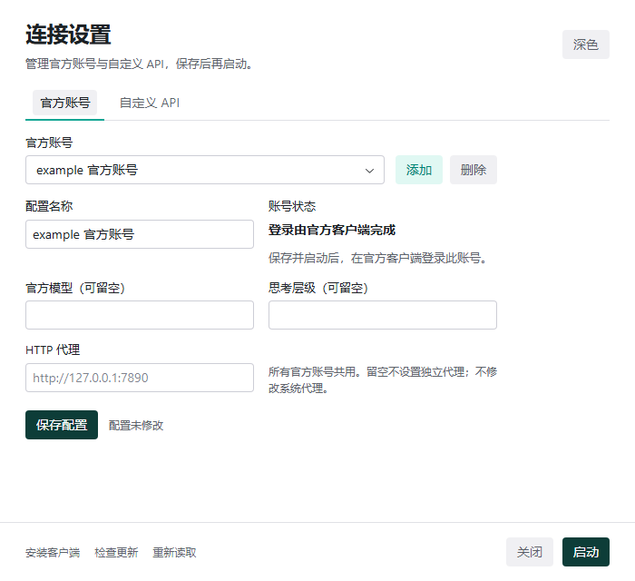

# 使用与 CLI 命令

## 配置目录

目录优先级：CLI `--config-dir`、`CHATGPT_API_ONLY_CONFIG_DIR`、`CODEX_HOME`、用户主目录下的 `.codex`。GUI 与 CLI 共用该目录时共享配置库。

| 文件 | 用途 |
| --- | --- |
| `config.toml` | 当前 provider、模型、路由与其他 Codex 设置 |
| `auth.json` | 当前官方凭据或 API Key |
| `.env` | 仅管理 `CHATGPT API ONLY PROXY` 标记区块 |
| `launcher-profiles/modes.json` | 多账号、API 配置、提供者快照与官方代理偏好 |
| `launcher-profiles/window.json` | 桌面窗口的尺寸、位置与最大化状态，仅本机有效 |
| `backups_state/provider-sync` | 历史修复前的 rollout 与 SQLite 一致性备份 |
| `launcher-profiles/logs/launcher.log` | 操作失败诊断 |

配置和备份包含私人凭据，不进入源码仓库。

## 桌面操作

添加、复制 API、删除、改名、切换 Tab 或选择配置只改变草稿。修改“配置名称”即可改名。“保存配置”保存当前模式和整个配置库草稿，成功后留在设置页；关闭不撤销已保存配置。GUI 不删除当前模式最后一项配置，需先添加其他配置。

API 地址使用 `https://主机/路径/v1`，提供者显示名称与历史 provider ID 分离。API 模式固定使用 `custom` ID；官方模式使用内置 `openai`。官方模式保留不带自定义地址、Key、请求头的 `custom` 定义，使旧对话仍能解析。



登录、刷新和联网验证由 Codex 完成。新增账号不携带其他账号旧令牌；客户端明确退出登录后，不再恢复该账号旧凭据。部分损坏的令牌阻止读取，避免误判为退出登录。

官方 HTTP 代理只影响新启动客户端、子进程和读取同一 `.env` 的 CLI，不修改系统代理或父终端环境。清空代理或切到 API 模式时，仅移除管理区块，原有内容保留；原有代理变量仍可能生效。

窗口尺寸、位置和最大化状态在退出时记住，下次打开按记住的几何还原；记住的位置不在任何显示器上时改由系统摆放。最大化或最小化期间的尺寸不覆盖手动调整过的还原尺寸。

保存或启动遇到外部变化时保留草稿。“重新读取”可读取最新配置，存在草稿时先确认放弃。修复历史期间应关闭正在写入历史的客户端。

## CLI

修改命令会保存，但不自动启动。`launch` 是唯一启动入口，默认运行 Codex CLI，`--desktop` 运行桌面客户端。

```sh
chatgpt-api-only --help
chatgpt-api-only list
chatgpt-api-only add official "example account"
chatgpt-api-only launch -- login
```

登录后下次执行命令会识别并收录当前官方凭据；账号名称不是认证状态。

```sh
chatgpt-api-only add custom "example API" --provider "example provider" --url https://api.example.com/v1 --key-file example-key.txt --model example-model
chatgpt-api-only use custom CONFIG_ID
chatgpt-api-only edit CONFIG_ID --model example-other-model
chatgpt-api-only rename custom CONFIG_ID "example renamed"
chatgpt-api-only add custom "example copy" --copy CONFIG_ID
chatgpt-api-only delete custom CONFIG_ID
```

`--key-file -` 从标准输入读取 Key。最后一项活动配置不能被删除后直接应用；应先切换到另一模式的可用配置。删除其他模式的最后一项不影响活动模式。

```sh
chatgpt-api-only proxy http://127.0.0.1:7890
chatgpt-api-only proxy ""
chatgpt-api-only launch
chatgpt-api-only launch --desktop
chatgpt-api-only launch --dry-run
chatgpt-api-only launch --executable /path/to/codex -- --help
```

`--dry-run` 只输出计划。Linux CLI 不添加 Electron 域名参数。

完整编辑支持导出和应用：

```sh
chatgpt-api-only export > example-draft.json
chatgpt-api-only apply example-draft.json
```

导出包含凭据和读取版本。外部修改后旧草稿不能覆盖新配置，需重新导出并核对差异。

```sh
chatgpt-api-only repair
chatgpt-api-only repair --yes
```

修复仅将 JSONL `session_meta.payload.model_provider`、SQLite `threads.model_provider` 和存在时的 `local_thread_catalog.model_provider` 改为 `custom`，不修改显示名称或云端对话。不带 `--yes` 时默认取消；确认后先备份，进度来自实际数量。

## 分发与平台启动

Windows 便携 ZIP 只包含 `ChatGPTApiOnly.exe`，需要 WebView2；NSIS 安装包可处理缺失运行时。CLI 单独分发。macOS 使用 `.app` 压缩包，未配置 Apple 发布证书时未经 Developer ID 签名和公证，构建成功不代表无提示分发。

Windows 自动发现当前用户最高版本 `OpenAI.Codex` 包。macOS 查找 `/Applications/Codex.app` 和用户 Applications 目录。客户端缺失或启动失败时留在设置页；安装入口在 Windows 打开 Microsoft Store，其他平台打开 Codex 下载页。macOS“检查更新”是下载入口，不声称执行了更新检查。